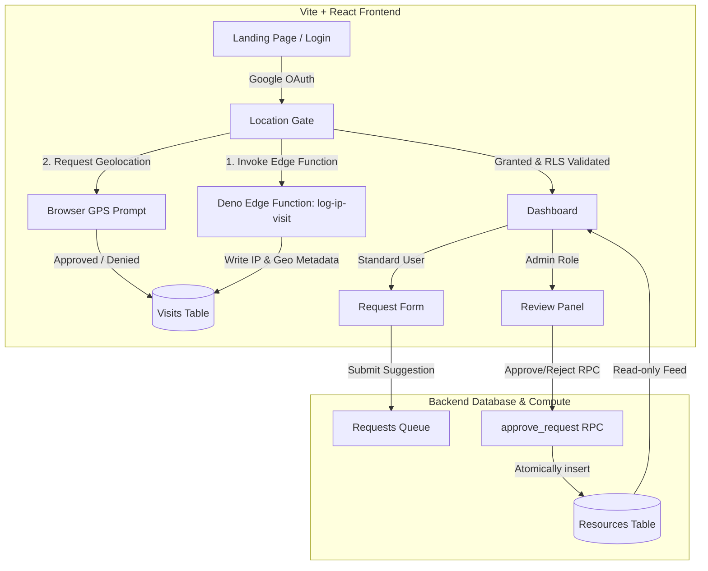

# Amazing Websites (The Vault) 🏛️

A secure, premium visual repository for curating design resources, UI/UX animations, fonts, and developer tools. This project features high-fidelity visual aesthetics, reactive card layouts, robust authentication, and geolocation-based access control.

---

## 🏗️ System Architecture

The application is built on a modern decoupled architecture using a client-side single page application (SPA) paired with a backend-as-a-service (BaaS) and serverless edge compute.



---

## 🔒 Security & Verification Framework

This application implements a multi-layered security protocol designed to protect the integrity of the resource index and enforce compliance policies:

### 1. Geolocation Enforcement (The Location Gate)
Access to the resource dashboard is protected by a dual-stage verification sequence:
* **Unconditional Server-Side Audit**: Upon mounting, the client triggers the `log-ip-visit` Deno Edge Function. This reads the real connection IP (`x-real-ip` / `x-forwarded-for`) to prevent client-side spoofing, fetches geodata from `ipapi.co`, and saves a permanent connection log to the database.
* **Browser Geolocation Prompt**: Standard browser-level GPS coordinates are requested. A granted prompt records coordinate-based visits and opens the gate. A denied prompt logs a rejection state and renders a blocking gate UI.
* **Database RLS Verification**: Row Level Security (RLS) on the database ensures that content reads from the `resources` table are only permitted if the requesting user has a valid, recent location grant in the `visits` ledger (configured via SQL trigger checking `has_recent_granted_location`).

### 2. User Authentication & Profile Synchronization
* Integrated with **Google OAuth** via Supabase Auth.
* Upon login or token refresh, user profiles are automatically synchronized with the database `users` table, generating clean, split first/last name columns from metadata.

### 3. Separation of Concerns & Admin Authorization
* **Suggest/Review Pipeline**: Standard users can suggest resources through the `RequestForm`, which records drafts to the `requests` table instead of editing live resources.
* **Atomic RPC Operations**: Administrator actions are processed through database remote procedure calls (`approve_request` and `reject_request`). The transition of a suggestion to the live `resources` index and the addition of contribution metrics happen transactionally on the server side to eliminate tampering.

---

## 🎨 UI & Interactive Components

The frontend values premium aesthetics, fluid motion design, and high-quality user experiences:

| Component | Description | Tech Highlight |
| :--- | :--- | :--- |
| **Gooey Text Morphing** | Dynamic text animation scene on the landing page. | Canvas-free pure CSS/SVG filters |
| **Location Gate UI** | Centered blocking modal requesting location context. | HSL theme variables + Micro-animations |
| **Floating Glassy Nav Bar** | Apple-style floating header featuring responsive mobile drawer menu and scroll-dependent scale transitions. | Glassmorphism, backdrop-blur, CSS transitions |
| **Card Stack** | Multi-layered interactive carousel presenting resources. | High-performance transform-based swiping |
| **Sticky Coding Stack** | Stacking interactive cards that shrink, rotate, and fade out smoothly as you scroll. | Linear scroll tracking, Framer Motion, layout overflow-safe |
| **Category Cards** | Dedicated card skins for categories (Filmstrip, Terminal, Font, Code, Editorial). | Embedded `.webm` loop support + Custom SVG icons |
| **Request Form** | Suggestion UI featuring a detailed simulated sending workflow. | CSS Keyframes for realistic envelope-delivery animation |

---

## 🛠️ Tech Stack

* **Frontend**: React 19, Vite, Framer Motion, Lucide Icons
* **Smooth Scrolling**: Lenis (`lenis/react`) root-level smooth scroll container
* **Styling**: TailwindCSS & Pure CSS Variables (Glassmorphism, Responsive Grid System)
* **Backend**: Supabase Auth (Google Provider), Supabase Database (PostgreSQL)
* **Edge Compute**: Deno Deploy / Supabase Edge Functions
* **Third-Party Services**: `ipapi.co` (IP Geolocation Lookup)

---

## 🚀 Getting Started

### 📋 Prerequisites
* [Node.js](https://nodejs.org/) (v18+)
* [Supabase CLI](https://supabase.com/docs/guides/cli)

### 💻 Local Development Setup

1. **Clone the repository and install dependencies**:
   ```bash
   npm install
   ```

2. **Configure local environment variables**:
   Create a `.env.local` file in the root directory:
   ```env
   VITE_SUPABASE_URL=https://your-project-id.supabase.co
   VITE_SUPABASE_ANON_KEY=your-anonymous-key
   ```

3. **Start the Vite local development server**:
   ```bash
   npm run dev
   ```

4. **Deploying Supabase Edge Functions**:
   Make sure you are logged in to the Supabase CLI, then push your edge functions to the remote project:
   ```bash
   npx supabase login
   npx supabase functions deploy log-ip-visit
   ```
