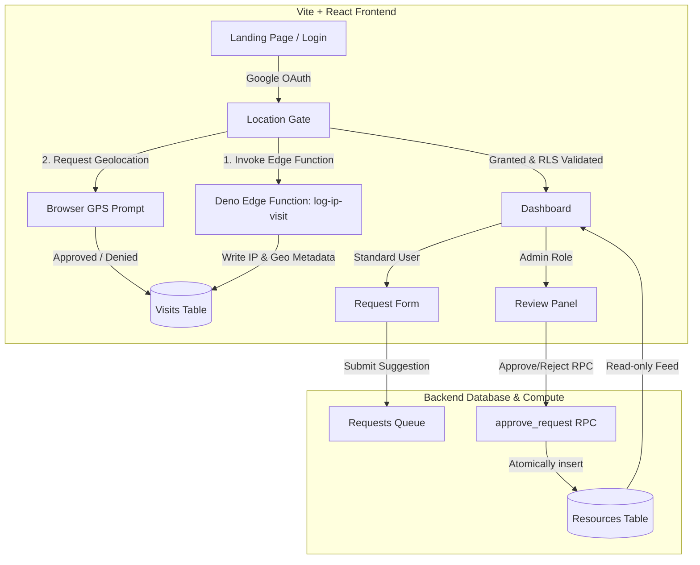

# $\color{#e35b30}{\text{Amazing Websites (The Vault) 🏛️}}$

A secure, premium visual repository for curating $\color{#e35b30}{\text{design resources}}$, $\color{#639922}{\text{animations}}$, $\color{#b68a35}{\text{fonts}}$, and $\color{#1f4d3d}{\text{developer tools}}$. This project features high-fidelity visual aesthetics, reactive card layouts, robust authentication, and geolocation-based access control.

---

## 📖 Comprehensive Documentation (Wikis)

For in-depth explanations of the system design, database schemas, edge configurations, and visual animations, check out the **[Official GitHub Wiki](https://github.com/allenjose24/amazing-websites/wiki)** or explore the pages directly in the codebase:

* **[<font color="#b68a35">Wiki Home</font>](./docs/Home.md)**: Repository overview, philosophy, design system, and code structure.
* **[<font color="#e35b30">Architecture & Data Flows</font>](./docs/Architecture-&-Flows.md)**: System interactions, login sequences, location audits, and submission pipelines.
* **[<font color="#1f4d3d">Database Schema & RLS</font>](./docs/Database-Schema-&-RLS.md)**: Table definitions, triggers, constraints, security checks, and admin RPC transactions.
* **[<font color="#639922">Edge Functions</font>](./docs/Edge-Functions.md)**: Server-side geocoding and visitor IP logging via Deno Deploy.
* **[<font color="#e35b30">Frontend Structure & State</font>](./docs/Frontend-Structure-&-State.md)**: React 19 bootstrappers, Auth listeners, Location Gate lifecycles, and dashboard components.
* **[<font color="#b68a35">Interactive UI Components</font>](./docs/Interactive-UI-Components.md)**: Matrix calculations for gooey text morphs, card stacks, custom layouts, and form animations.
* **[<font color="#0066cc">GitHub Wiki Hosting Guide</font>](./docs/GitHub-Wiki-Hosting-Guide.md)**: Publishing details for GitHub Wiki deployment.

---

## 🏗️ System Architecture

The application is built on a modern decoupled architecture using a client-side single page application (SPA) paired with a backend-as-a-service (BaaS) and serverless edge compute.



---

## 🔒 Security & Verification Framework

This application implements a multi-layered security protocol designed to protect the integrity of the resource index and enforce compliance policies:

### 1. $\color{#8b2635}{\text{Geolocation Enforcement (The Location Gate)}}$
Access to the resource dashboard is protected by a dual-stage verification sequence:
* **$\color{#8b2635}{\text{Unconditional Server-Side Audit}}$**: Upon mounting, the client triggers the `log-ip-visit` Deno Edge Function. This reads the real connection IP (`x-real-ip` / `x-forwarded-for`) to prevent client-side spoofing, fetches geodata from `ipapi.co`, and saves a permanent connection log to the database.
* **$\color{#0066cc}{\text{Browser Geolocation Prompt}}$**: Standard browser-level GPS coordinates are requested. A granted prompt records coordinate-based visits and opens the gate. A denied prompt logs a rejection state and renders a blocking gate UI.
* **$\color{#1f4d3d}{\text{Database RLS Verification}}$**: Row Level Security (RLS) on the database ensures that content reads from the `resources` table are only permitted if the requesting user has a valid, recent location grant in the `visits` ledger (configured via SQL trigger checking `has_recent_granted_location`).

### 2. $\color{#b68a35}{\text{User Authentication}}$ & $\color{#b68a35}{\text{Profile Synchronization}}$
* Integrated with **Google OAuth** via Supabase Auth.
* Upon login or token refresh, user profiles are automatically synchronized with the database `users` table, generating clean, split first/last name columns from metadata.

### 3. $\color{#1f4d3d}{\text{Separation of Concerns}}$ & $\color{#1f4d3d}{\text{Admin Authorization}}$
* **Suggest/Review Pipeline**: Standard users can suggest resources through the `RequestForm`, which records drafts to the `requests` table instead of editing live resources.
* **Atomic RPC Operations**: Administrator actions are processed through database remote procedure calls (`approve_request` and `reject_request`). The transition of a suggestion to the live `resources` index and the addition of contribution metrics happen transactionally on the server side to eliminate tampering.

---

## 🛡️ Repository Security & Quality Policies

To enforce code compliance, automate vulnerability scanning, and coordinate code reviews, the repository implements the following policies:

### 1. $\color{#0066cc}{\text{Continuous Integration (CI) Pipeline}}$
* **Configuration**: Located in [.github/workflows/ci.yml](file:///d:/antigravity/amazing-websites/.github/workflows/ci.yml).
* **Environment**: Runs inside a clean Ubuntu runtime utilizing **Node.js v22** (matching Vite requirements).
* **Checks Triggered**: Executed on push/PR events to `main` and `feat` branches.
  * **Fresh Install Audit**: Invokes `npm ci` to verify package trees install cleanly.
  * **Linter Quality Checks**: Runs `npm run lint` to enforce ESLint standards, code styling compliance, and hooks verification.
  * **Production Compilation Verification**: Runs `npm run build` to confirm Vite bundles assets without syntax errors.

### 2. $\color{#b68a35}{\text{Dependabot Dependency Auditing}}$
* **Configuration**: Located in [.github/dependabot.yml](file:///d:/antigravity/amazing-websites/.github/dependabot.yml).
* **Monitoring Rules**:
  * **npm Packages**: Checks `package.json` dependencies weekly for known security vulnerabilities and automatically creates PRs to patch them.
  * **GitHub Actions**: Audits and auto-patches actions version tags in workflows.

### 3. $\color{#8b2635}{\text{Automatic Code Review Assignment (CODEOWNERS)}}$
* **Configuration**: Located in [.github/CODEOWNERS](file:///d:/antigravity/amazing-websites/.github/CODEOWNERS).
* **Policy**: Automatically assigns `@allenjose24` as a required reviewer on **all pull requests** and changes across the codebase.

### 4. $\color{#639922}{\text{Community Templates}}$
* **Issue Templates**: Standardized bug report and feature request skeletons reside in [.github/ISSUE_TEMPLATE/](file:///d:/antigravity/amazing-websites/.github/ISSUE_TEMPLATE/) to guide contributors on reporting bugs or proposing features.
* **Task Ideas Catalog**: Saved at [docs/Issue-Ideas-Template.md](file:///d:/antigravity/amazing-websites/docs/Issue-Ideas-Template.md) to serve as a copy-paste catalog for development sprints.

### 5. $\color{#8b2635}{\text{Repository Protection (Recommended GitHub Configurations)}}$
To fully enforce this policy framework, configure the following inside your GitHub settings panel:
* **Branch Protection**: Go to *Settings -> Branches -> Add protection rule* on `main`. Set **"Require a pull request before merging"** and **"Require status checks to pass before merging"** (selecting our `verify` job status check).
* **Secret Scanning**: Enable *Secret scanning* and *Push protection* under *Settings -> Code security* to prevent API credentials from being committed to your repository history.

---

## 🎨 UI & Interactive Components

The frontend values premium aesthetics, fluid motion design, and high-quality user experiences:

| Component | Description | Tech Highlight |
| :--- | :--- | :--- |
| **Gooey Text Morphing** | Dynamic text animation scene on the landing page. | Canvas-free pure CSS/SVG filters |
| **Location Gate UI** | Centered blocking modal requesting location context. | HSL theme variables + Micro-animations |
| **Floating Glassy Nav Bar** | Apple-style floating header featuring responsive mobile drawer menu and scroll-dependent scale transitions. | Glassmorphism, backdrop-blur, CSS transitions |
| **Card Stack** | Multi-layered interactive carousel presenting resources. | High-performance transform-based swiping |
| **Sticky Coding Stack** | Stacking interactive cards that shrink, rotate, and fade out smoothly as you scroll. | Linear scroll tracking, Framer Motion, layout overflow-safe |
| **Category Cards** | Dedicated card skins for categories (Filmstrip, Terminal, Font, Code, Editorial). | Embedded `.webm` loop support + Custom SVG icons |
| **Request Form** | Suggestion UI featuring a detailed simulated sending workflow. | CSS Keyframes for realistic envelope-delivery animation |

---

## 🛠️ Tech Stack

* **Frontend**: React 19, Vite, Framer Motion, Lucide Icons
* **Smooth Scrolling**: Lenis (`lenis/react`) root-level smooth scroll container
* **Styling**: TailwindCSS & Pure CSS Variables (Glassmorphism, Responsive Grid System)
* **Backend**: Supabase Auth (Google Provider), Supabase Database (PostgreSQL)
* **Edge Compute**: Deno Deploy / Supabase Edge Functions
* **Third-Party Services**: `ipapi.co` (IP Geolocation Lookup)

---

## 🚀 Getting Started

### 📋 Prerequisites
* [Node.js](https://nodejs.org/) (v22+)
* [Supabase CLI](https://supabase.com/docs/guides/cli)

### 💻 Local Development Setup

1. **Clone the repository and install dependencies**:
   ```bash
   npm install
   ```

2. **Configure local environment variables**:
   Create a `.env.local` file in the root directory:
   ```env
   VITE_SUPABASE_URL=https://your-project-id.supabase.co
   VITE_SUPABASE_ANON_KEY=your-anonymous-key
   ```

3. **Start the Vite local development server**:
   ```bash
   npm run dev
   ```

4. **Deploying Supabase Edge Functions**:
   Make sure you are logged in to the Supabase CLI, then push your edge functions to the remote project:
   ```bash
   npx supabase login
   npx supabase functions deploy log-ip-visit
   ```

---

## 🤖 Developer Automation (GitHub App MCP Integration)

This repository includes a custom token manager script ([mcp-github-app.cjs](./mcp-github-app.cjs)) to integrate with the GitHub MCP server as an enterprise-grade GitHub App. This ensures that any issues, branches, or Pull Requests created by AI agents are officially authored under a clean `[bot]` identity (rather than a personal account), allowing the repository owner to review, approve, and merge code changes.

### 📋 Setup Overview
1. **Register the GitHub App**: Create a private GitHub App on your account with read/write access to repository contents, issues, and PRs.
2. **Download Private Key**: Generate and download the App's private `.pem` key file and place it in the project root (automatically excluded from git history via `.gitignore` for security).
3. **Configure the Script**: Add your App ID and Installation ID inside `mcp-github-app.cjs`.
4. **Link in MCP config**: Point your MCP configuration (e.g., `mcp_config.json`) to launch via the script:
   ```json
   "local-github-mcp": {
     "command": "node",
     "args": ["d:/antigravity/amazing-websites/mcp-github-app.cjs"]
   }
   ```

For detailed instructions, see the complete guide at **[docs/GitHub-App-MCP-Setup.md](./docs/GitHub-App-MCP-Setup.md)**.
