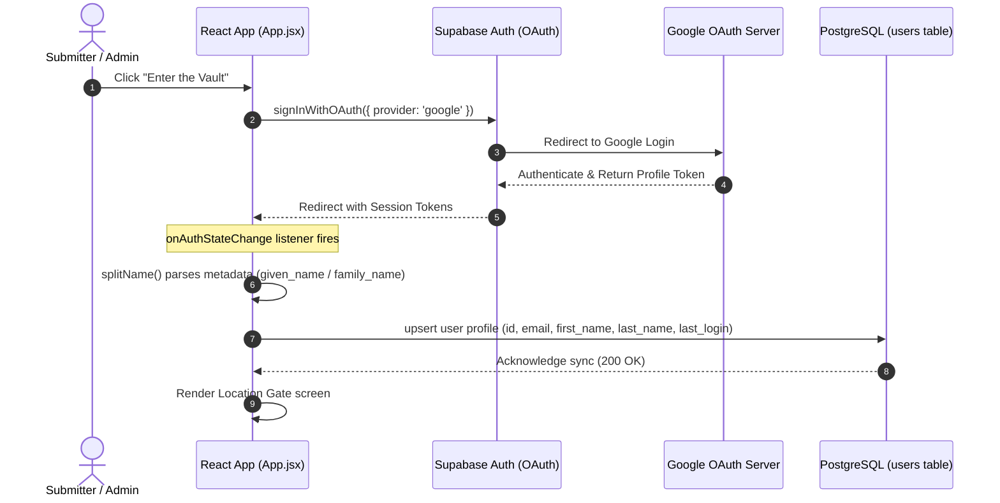
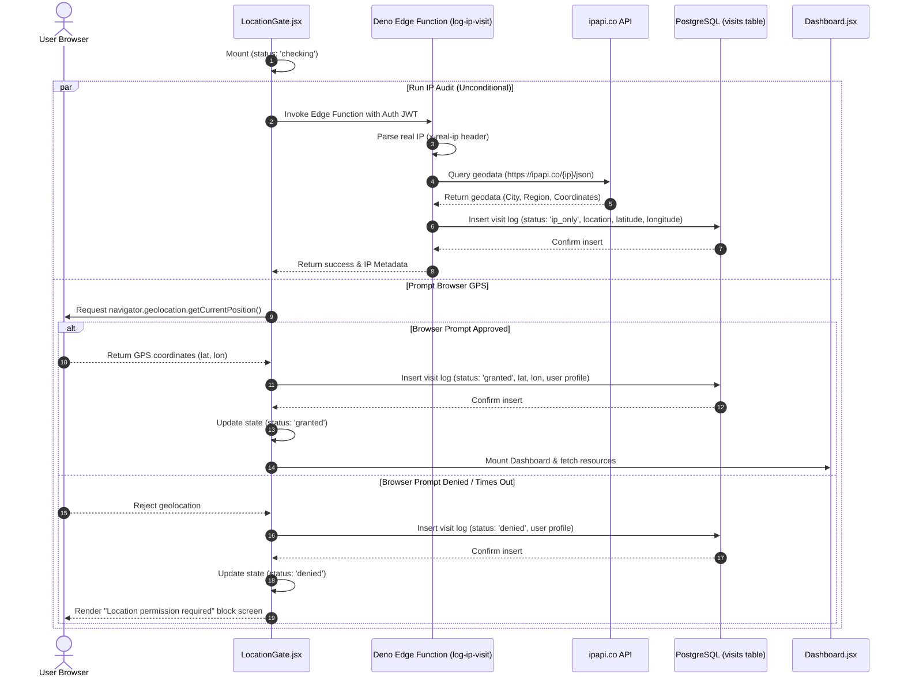
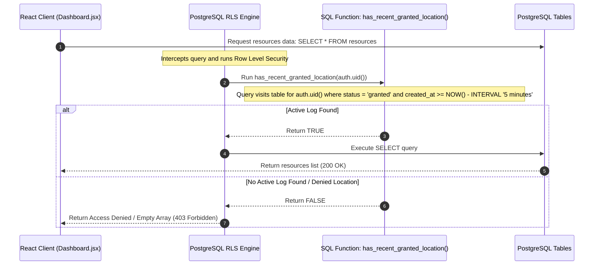
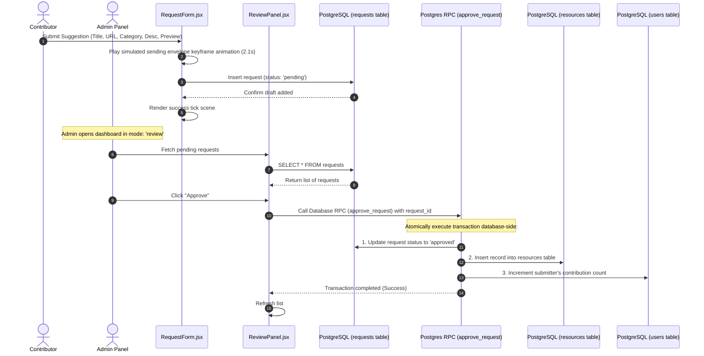

# Architecture & Detailed System Flows 🏗️

This document describes the structural architecture of the **Amazing Websites (The Vault)** platform, specifying each component's responsibility and diagramming critical system flows in exhaustive step-by-step detail.

---

## 🏗️ System Overview

The platform uses a fully decoupled architecture featuring a reactive client application, a serverless compute edge, and a transaction-safe relational database.

```
┌────────────────────────────────────────────────────────┐
│               Vite + React 19 Frontend                 │
│  - App.jsx (Session & Profile Sync)                    │
│  - LocationGate.jsx (UX Gate & Permission Handlers)    │
│  - Dashboard.jsx (Category Layout Router)              │
│  - RequestForm.jsx & ReviewPanel.jsx (Pipeline UX)      │
└───────────────────────┬────────────────────────────────┘
                        │
      Reads/Writes      │  Calls Edge Runtime
      with Anon Key     │  & database RPCs
                        ▼
┌────────────────────────────────────────────────────────┐
│              Supabase Backend-as-a-Service             │
│                                                        │
│  ┌────────────────────────┐  ┌──────────────────────┐  │
│  │   Deno Edge Runtime    │  │ PostgreSQL Database  │  │
│  │  - log-ip-visit Fn     │  │  - RLS Engine        │  │
│  │  - ipapi.co Geocoder   │  │  - Tables & RPCs     │  │
│  └────────────────────────┘  └──────────────────────┘  │
└────────────────────────────────────────────────────────┘
```

1. **Frontend Client**: A single-page application (SPA) built using React 19 and Vite. Styling is written in CSS with Tailwind. High-fidelity motion curves are managed via Framer Motion, and scroll mechanics are governed by Lenis.
2. **Backend Database**: Supabase PostgreSQL. Enforces Row Level Security (RLS) policies on reading resources, ensuring standard users cannot query the catalog unless location logs verify eligibility.
3. **Edge Runtime**: Deno Edge Functions hosted on Deno Deploy. Intercepts visits to perform server-side geocoding to prevent client-side GPS spoofing.

---

## 🔒 1. User Authentication & Profile Synchronization Flow

When a user signs in, the client communicates with Supabase Auth (via Google Provider). Once tokens are established, the profile synchronization pipeline updates personal metadata within the user ledger.



### Detailed Flow Description:
1. **Trigger**: The user clicks the button on the landing page, calling `supabase.auth.signInWithOAuth()`.
2. **Google Authentication**: The user logs in via Google's OAuth screen, redirecting them back to the application.
3. **Session Capture**: In `src/App.jsx`, a `useEffect` captures the token status using both `supabase.auth.getSession()` on load and `supabase.auth.onAuthStateChange()` for live events.
4. **Metadata Extraction**: The `splitName()` helper reads `user_metadata`. If explicit fields `given_name` and `family_name` exist, they are preferred. Otherwise, `full_name` is split by whitespace.
5. **Database Upsert**: The client fires `supabase.from('users').upsert(...)`. This updates the user profile record or creates it if it is their first login. It also updates the `last_login` timestamp.

---

## 📍 2. Geolocation Permission & Location Gate Flow

Every mount of the application forces location verification. The system executes an unconditional server-side audit in parallel with a user-interactive browser permission request.



### Detailed Flow Description:
1. **Failsafe Deno Trigger**: The React hook invokes the edge function (`log-ip-visit`) immediately. The edge function retrieves the request headers (specifically `x-real-ip` to bypass client modifications) and queries `ipapi.co`.
2. **IP Visit Logging**: The edge function logs an `ip_only` visit in the database.
3. **Browser GPS Request**: Simultaneously, the browser displays a permission prompt.
4. **Grant Sequence**:
   - If **Granted**: Coordinates are recorded, status updates to `granted` in the `visits` table, and the gate unblocks.
   - If **Denied**: A `denied` entry is recorded, state updates to `denied`, and a block screen displays a retry prompt.

---

## 🔒 3. Content Access / Row-Level Security Validation Flow

Even if a user manually modifies the client-side code to bypass the `LocationGate` layout, the database blocks any read requests unless the user has validated their location.



### Detailed Flow Description:
1. **Query Dispatch**: The Dashboard calls `supabase.from('resources').select('*')`.
2. **RLS Interception**: PostgreSQL intercepts the request, calling the `has_recent_granted_location()` security function.
3. **Time-decay Check**: The query checks if a row exists in `visits` for the requesting `auth.uid()` with `status = 'granted'` created within the last 5 minutes.
4. **Enforcement**: If the check fails, the query returns no records.

---

## 📝 4. Suggestion & Contribution Pipeline Flow

Standard users cannot insert rows directly into the main `resources` catalog. Instead, their suggestions are handled by a server-side transaction pipeline to protect catalog integrity.



### Detailed Flow Description:
1. **Submission Entry**: Submissions go to the `requests` table (marked `pending`), leaving the live database unaffected.
2. **UX Visual Buffering**: A 2.1-second envelope animation covers network latency, providing visual feedback while the client records the draft.
3. **Transactional Transition**: The admin approves the request via the remote procedure call `approve_request(request_id)`. The function runs as an atomic transactional query on the database. It updates the request's status, populates the resource catalog, and increments the contributor's counter.
